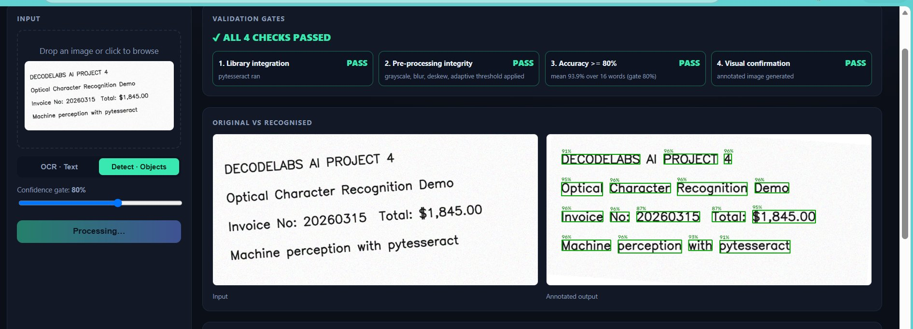
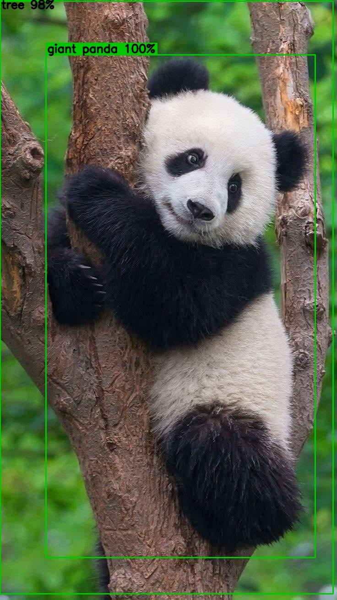
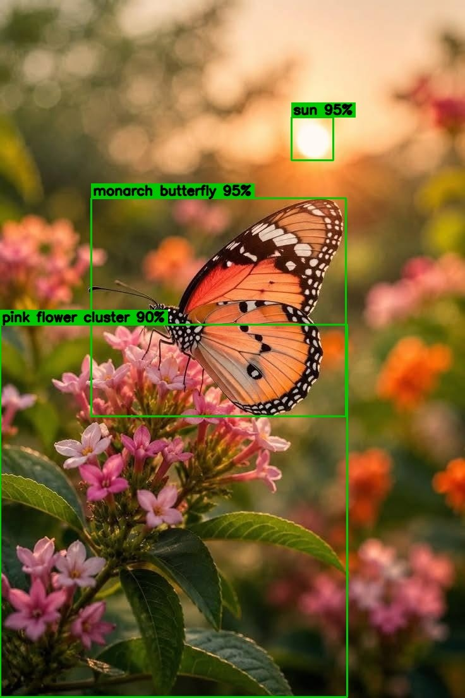
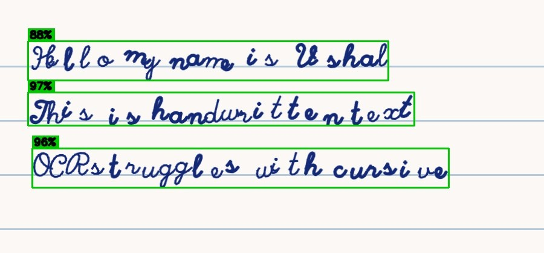
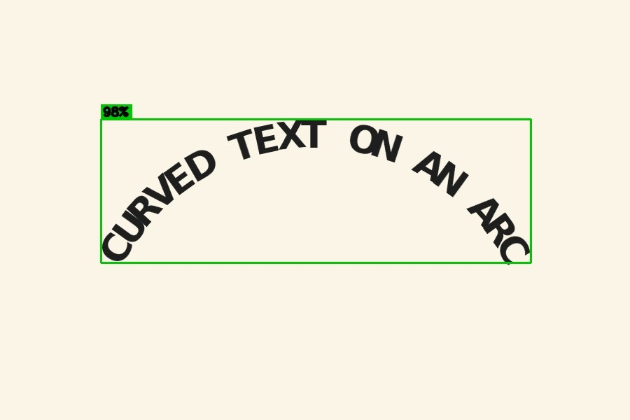
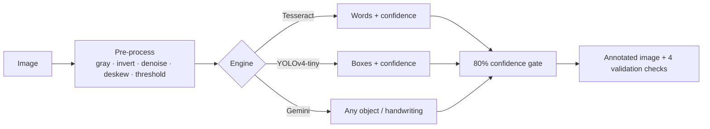
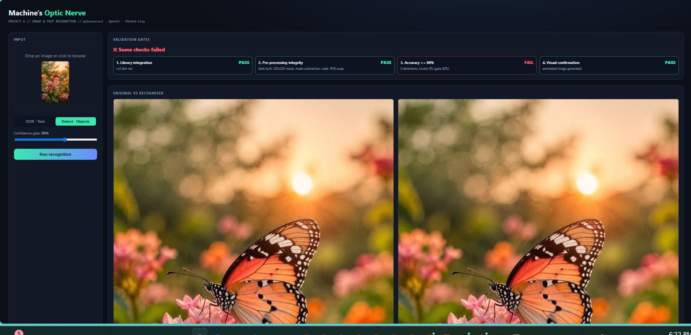

# Machine's Optic Nerve — Image & Text Recognition

A computer-vision web app that **reads text and finds objects in a photo**, throws away anything the model is not confident about (below **80 %**), and draws the surviving results straight onto the image. Built for **DecodeLabs AI Project 4** (OpenCV · pytesseract · `cv2.dnn`), then extended with a free Google Gemini engine so it can recognise *any* object and even **handwriting and curved text**.



**Live results gallery (real pipeline output, no install needed):** `https://<your-username>.github.io/<repo-name>/`

---

## What it does

Pick an image, pick a mode, press **Run recognition**. The page shows four validation badges, the input next to the annotated output, every pre-processing step, the extracted text (with a copy button) and a confidence bar for each result.

| Engine | Used for | Strengths |
|---|---|---|
| **Classic · offline** | OpenCV + Tesseract (OCR), OpenCV DNN + YOLOv4-tiny (objects) | Runs fully on your machine, no account, no internet after setup |
| **Gemini · any object** | Google Gemini free API | Any object (not just 80 classes), several per photo, handwriting, curved and multi-language text |

### Gemini engine results

**Detects several things in one photo, with open-ended names** (not limited to a fixed list):

<p>
  
  
</p>

**Reads handwriting and text on a curve** — the two cases classic Tesseract cannot handle:

<p>
  
  
</p>

> The percentages on Gemini results are **the model's own 0–100 estimate**, not a calibrated probability. The 80 % gate still filters on them, but treat them as a confidence hint.

---

## How it works



### The four validation gates

1. **Library integration** — the OCR / detection library actually ran.
2. **Pre-processing integrity** — grayscale → auto-invert (light text on dark) → median + Gaussian denoise → deskew → adaptive & Otsu threshold. The best binarisation and Tesseract layout mode (PSM) are picked automatically.
3. **Accuracy ≥ 80 %** — OCR needs a mean confidence ≥ 80 % **and** at least 60 % of detected words above the gate, so one lucky word can never pass a whole image. Detection keeps only boxes at or above 80 %; weaker guesses are drawn thin and grey ("below gate") so you can see what was rejected.
4. **Visual confirmation** — boxes, labels and confidence scores drawn on the output image.

---

## Tech stack

- Python 3.10+, Flask (web server)
- OpenCV (`opencv-python-headless`) + NumPy
- pytesseract + the Tesseract OCR engine
- YOLOv4-tiny (COCO) through `cv2.dnn` — downloaded automatically on first use (~25 MB)
- Google Gemini API (free tier) over plain HTTPS — no SDK
- Vanilla HTML / CSS / JS frontend, no build step

---

## Running it locally

**Prerequisites:** Python 3.10 or newer and the **Tesseract program** (it is not a pip package).

| OS | Install Tesseract |
|---|---|
| Windows | <https://github.com/UB-Mannheim/tesseract/wiki> |
| macOS | `brew install tesseract` |
| Linux | `sudo apt install tesseract-ocr` |

```bash
python -m venv venv
venv\Scripts\activate          # macOS / Linux: source venv/bin/activate
pip install -r requirements.txt
python server.py
```

Open the URL it prints, normally:

```
http://127.0.0.1:5000
```

Press `Ctrl+C` in the terminal to stop the server.

If the app says "Tesseract not found", point it to the program once:

```powershell
$env:TESSERACT_CMD = "C:\Program Files\Tesseract-OCR\tesseract.exe"   # your actual path
```

### Do I need a Gemini API key?

Only for the **Gemini** engine. The Classic engine needs no key and no account.

1. Create a free key at <https://aistudio.google.com/apikey>.
2. Copy `.env.example` to `.env` and paste the key after `GEMINI_API_KEY=`.
3. Restart `python server.py` and choose **Gemini · any object** in the page.

The newest working Gemini Flash model is looked up automatically, so a model rename on Google's side does not need a code change. To force one anyway, add `GEMINI_MODEL=model-name` to `.env`. `.env` is git-ignored — never commit your key.

### Other commands

| Command | What it does |
|---|---|
| `python server.py` | Start the web app |
| `python recognition.py ocr samples/sample_text.png` | OCR from the command line |
| `python recognition.py detect your_photo.jpg` | Object detection from the command line |
| `python recognition.py ocr image.png --psm 11` | Pick a Tesseract layout mode (3, 6, 7, 11) |
| `python make_samples.py` | Regenerate the synthetic test images in `samples/` |

Command-line runs save the annotated image and a JSON report in `outputs/`.

---

## Test images (`samples/`)

| File | What it tests | Classic engine |
|---|---|---|
| `sample_text.png` | tilt + noise | ✅ pass |
| `2_wavy_banner.png` | warped text | ✅ pass |
| `3_low_light_shadow.png` | dim, uneven light | ✅ pass |
| `4_blur_noise.png` | blur + salt-and-pepper noise | ✅ pass |
| `6_rotated_inverted_sign.png` | white text on dark, rotated | ✅ pass |
| `1_curved_arc.png` | text on a circular arc | ❌ rejected by the gate (Tesseract limit) |
| `5_handwriting_cursive.png` | cursive handwriting | ❌ rejected by the gate (Tesseract limit) |

The two rejected images are the same ones the Gemini engine reads in the screenshots above.

---

## Honest limits

- **Tesseract** reads straight printed text well, but not curved text or handwriting. The gate rejects those instead of showing wrong text.
- **YOLOv4-tiny** only knows the 80 COCO classes, so a butterfly or a flower is outside its vocabulary:

  

- **Gemini** sends your photo to Google's API, is subject to the free-tier rate limit, and gives self-reported confidence.
- The full app needs the Tesseract program installed, so it cannot run on serverless static hosts. The results gallery in `docs/` is pre-computed instead.

---

## Deploying the gallery

`docs/` is a self-contained static page. On GitHub: **Settings → Pages → Deploy from a branch → `main` → `/docs`**.

---

## Project structure

```
server.py            Flask app and /api/recognize endpoint, builds the 4 validation badges
recognition.py       Pre-processing, Tesseract OCR, YOLOv4-tiny detection, 80 % gate
gemini_engine.py     Gemini engine: model discovery, prompts, parsing, box drawing
static/index.html    Frontend (drag-and-drop, pipeline steps, confidence bars)
make_samples.py      Generates the synthetic test images
samples/             Test images
docs/                GitHub Pages results gallery + README images
requirements.txt     Python dependencies
.env.example         Template for the optional Gemini key
```

---

## Credits

Built as a learning project for DecodeLabs. Test images are synthetic and generated by `make_samples.py`; the screenshots in this README are outputs of this app. OCR by [Tesseract](https://github.com/tesseract-ocr/tesseract), vision by [OpenCV](https://opencv.org), YOLOv4-tiny by the [Darknet](https://github.com/AlexeyAB/darknet) project, and Google Gemini.
